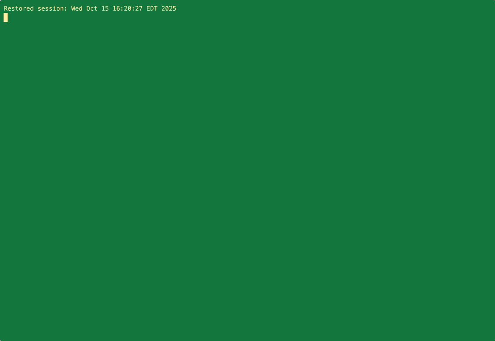

# Claude Code Plugins

A collection of plugins for [Claude Code](https://claude.com/claude-code) that extend its functionality.



## Installation

Install plugins from the Claude Code Marketplace:

```bash
claude
/plugin marketplace add seekayel/claude-plugins
/plugin install rpi@seekayel/claude-plugins
/plugin install cmd@seekayel/claude-plugins
```

After installation, restart your Claude Code session or reload your configuration.

## Plugins

### rpi - Research-Plan-Implement

A structured workflow plugin based on the [RPI methodology](https://block.github.io/goose/docs/tutorials/rpi/) that trades speed for clarity, predictability, and correctness.

**Commands:**
| Command | Description |
|---------|-------------|
| `/rpi:1_research_codebase` | Conduct comprehensive codebase research with parallel sub-agents |
| `/rpi:2_create_plan` | Create detailed implementation plans through iterative design |
| `/rpi:3_validate_plan` | Validate that implementation plans were correctly executed |
| `/rpi:4_implement_plan` | Implement approved plans phase-by-phase with progress tracking |

**Workflow:**
1. **Research** - Document existing implementations without evaluation
2. **Plan** - Design implementation with explicit success criteria
3. **Implement** - Execute mechanically, phase by phase
4. **Validate** - Verify implementation matches the plan

See [rpi/](rpi/) for detailed command documentation.

---

### cmd - Reference Implementation Testbed

A "hello world" style plugin demonstrating all Claude Code plugin feature types. Use this as a learning resource when building your own plugins.

**Commands:**
| Command | Description |
|---------|-------------|
| `/cmd:for` | Loop over templates using for-loop syntax, creating todo items |
| `/cmd:hello` | Simple hello world greeting with current time and directory |

**Additional Components:**
- **Agents** - `hello-agent` for context-aware greetings
- **Skills** - `hello-skill` auto-invoked for welcome/greeting files
- **Hooks** - Session start welcome message, tool usage logging
- **MCP** - Example server configuration

#### cmd:for - Loop Command

Batch create todo items using for-loop syntax:

```bash
/cmd:for i in [3,5,42] "Review PR ${i} for security concerns"
```

Creates three todo items:
- Review PR 3 for security concerns
- Review PR 5 for security concerns
- Review PR 42 for security concerns

See [cmd/README.md](cmd/README.md) for complete documentation.

## Repository Structure

```
claude-plugins/
├── .claude-plugin/
│   └── marketplace.json    # Marketplace configuration
├── rpi/                    # Research-Plan-Implement plugin
│   ├── .claude-plugin/
│   └── commands/
├── cmd/                    # Command testbed plugin
│   ├── .claude-plugin/
│   ├── commands/
│   ├── agents/
│   ├── skills/
│   ├── hooks/
│   └── .mcp.json
└── README.md
```

## Contributing

Contributions welcome! Please open an issue or PR.

## License

MIT - See [LICENSE](LICENSE) for details.
